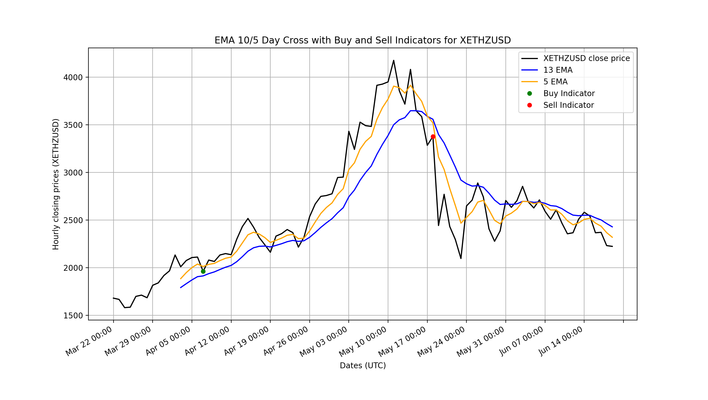
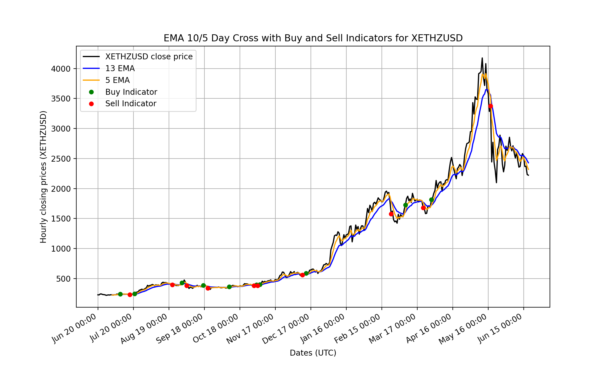

# Ethereum Crypto Trading Bot
Ethereum trading bot using an EMA 10-5 day cross indicator

# Technologies Used
* Python
* Numpy
* Pandas
* MatPlotLib
* Kraken API
* Docker

# Backtesting results
## 3 months from June 19
* profits: $72.155
* profit (%): 72.155%

## 1 year from June 19
* profits: $719.138
* profit (%): 719.138%

# Disclaimer
If you want to use this bot, you are using it at your own risk. I'm not responsible for any money lost.