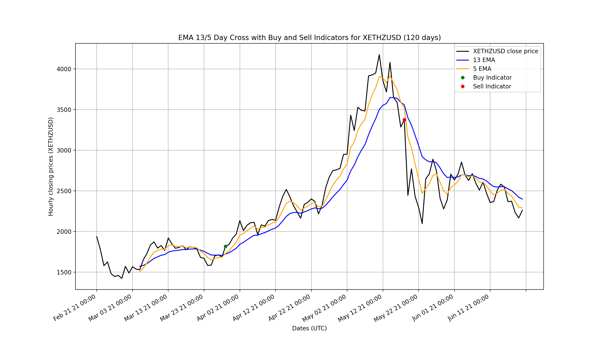
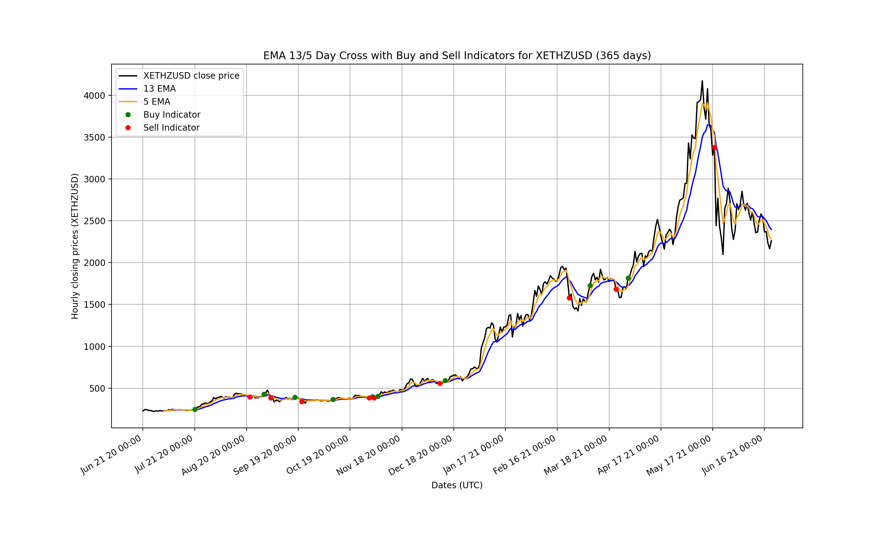

# Crypto Trading Bot
My crypto trading bot that uses a simple EMA 13-5 day cross indicator with a stop loss set at 10%. Also provides backtesting and plotting functionality. **Note**: I don't recommend using this bot to trade live as this was just for fun, however if you do, you have to figure out how to do all the coinbase setup as an exercise.

# Technologies Used
* Python
* Numpy
* MatPlotLib
* Coinbase API
* Docker

# Setup
* clone repo with `git clone <clone_url>`
* initialize python virtual environment `python3 -m venv env`
* start virtual environment `source env/bin/activate`
* install dependencies `pip install -r requirements.txt`
* Create Kraken account at https://www.kraken.com/en-gb/sign-up
* Create and copy API and secret keys to .env as outlined in sample.env
* Setup complete!

# Running
`python app.py <COMMAND>`

# Commands
* `help` list commands
* `test <DAYS>` run a backtest of `<DAYS>` length from today
* `plot <DAYS>` plot the strategy and it's performance on an MPL plot within the period of `<DAYS>` days ago to now (just like the ones seen below)
* `run` run the strategy live *NOTE* I have not written the code to allow the bot to run live. If you want to do so, you have to figure it out for yourself.

# Testing
`python -m unittest discover`

# Configuration

# Backtesting results for Ethereum in USD
### 3 months from June 20, 2021
* Starting funds: $200
* Net gains: $171.91
* profit (%): 85.958%

### 1 year from June 20, 2021
* Starting funds: $200
* Net gains: $1502.31
* profit (%): 751.158%

# Disclaimer
If you want to use this bot, you are using it at your own risk. I'm not responsible for any money lost. Results in using the bot may vary.
