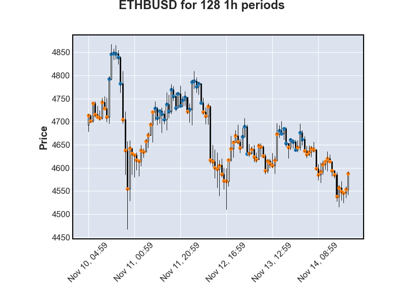
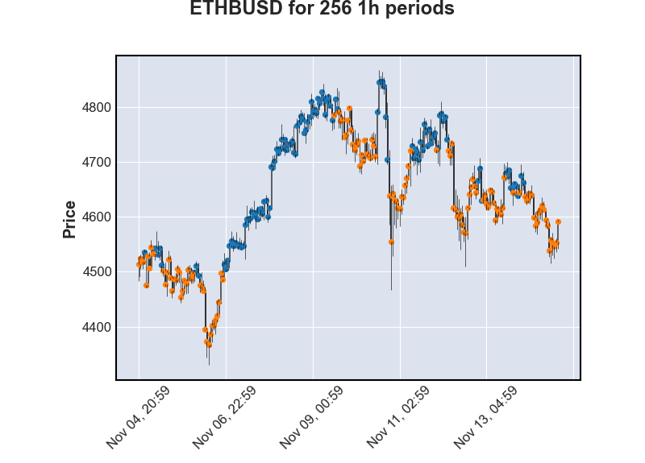
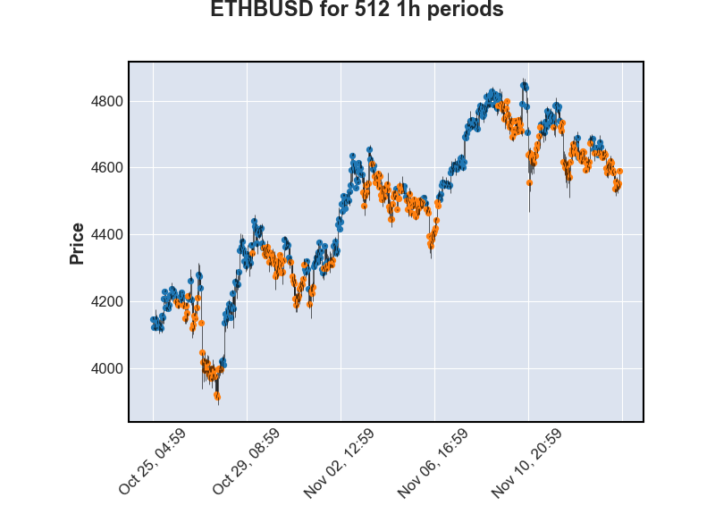

# Crypto Trading Bot
My crypto trading bot that uses a 12-5 EMA cross and 21 RSI strategy. This strategy enters a long position when the 5-period EMA crosses above the 12-period EMA and RSI has already crossed 50. This position is closed when either RSI crosses below 50 or the 12-period EMA dips below the 5-period EMA. The bot is also implemented in a way that allows you to deposit or withdraw funds without having to stop the bot.

# Technologies Used
* Python
* MatPlotLib
* Binance API
* Docker

# Setup
* clone repo with `git clone <clone_url>`
* initialize python virtual environment `python3 -m venv env`
* start virtual environment `source env/bin/activate`
* install dependencies `pip install -r requirements.txt`
* Create Binance account and generate API keys and enable permission for that API key to trade
* Create new file `config.py`
* Copy those values to `config.py` as outlined in `config.example.py`
* Setup complete!

# Running
`python main.py <COMMAND>`

# Commands
* `-h` list example
* `-b <DAYS>` run a backtest of `<DAYS>` length from today
* `-r` run the strategy live

# Backtesting Results
* Legend:
  * Blue = Buy signal
  * Orange = Sell signal

# Disclaimer
Feel free to use this bot and play around with the parameters, but I am not responsible for any money lost and you accept all the risks when using this. The results in the images may also vary from your experience.